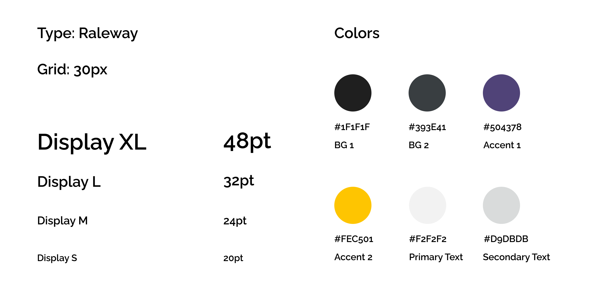

# UX Project
## Lindsey Mardona - Digital Humanities 110 - Spring 2022
### Assignment 06: Interface Design

# Description #
Ultimate Guitar is a music-learning website which focuses on tablature and chordsheets. While the site can be extremely helpful for musicians of various levels of expertise, past assessments including the [heuristic evaluation](https://github.com/lindseymardona/22s-dh110/blob/main/week-01/heuristic-evaluation.md) and [usability testing](https://github.com/lindseymardona/22s-dh110/blob/main/week-02/usability-testing.md) have raised the issue of certain shortcomings in interface design and usability. In order to address the conclusions drawn from these evaluations, a [low fidelity prototype](https://github.com/lindseymardona/22s-dh110/blob/main/week-05/lowfidelityprototype.md) was developed to express an initial intent of how the design may be materialized.

# Process and Purpose #
Based on the drafted layout from the [low fidelity prototype](https://github.com/lindseymardona/22s-dh110/blob/main/week-05/lowfidelityprototype.md), Figma shall be used in order to create several mock ups of the proposed interface design. In addition, Spark shall be used for usability testing, namely color contrast checking. Finally, an impression test shall be conducted in order to determine if the look and feel of the project fit the intention of the project, as well as receive any feedback on how to improve the interface design.

At this stage of the process, the objective shall be to create and test possible design ideas for the interface, which will later be used for the high fidelity prototype. This shall be done while prioritizing usability concerns and the presentation of information. By proposing several different variations of the design, the strengths and weaknesses of each design can be reasoned through, and ultimately result in the final design.

# Wireframe #

The full screen design tests can be accessed [here](https://www.figma.com/file/4UFE4J6DPuM7hFXYf34K00/DH110---As6?node-id=2%3A13).

# Screen Design #
## Spacing ##

## Typographic Variations ##

### Typographic Variation 1: Montserrat ###

### Typographic Variation 2: Raleway ###

### Typographic Variation 3: Work Sans ###

## Shape Variations ##

### Shape Variation 1: 37px ###

### Shape Variation 2: 10px ###

### Shape Variation 3: 60px ###

## Color Variations ##

### Color Variation 1: Light Mode ###

### Color Variation 2: Dark Mode ###

# Impression Test #
The impression test can be found [here](https://youtu.be/s8qyd5lGtUw).
The conclusions from the impression test are as follows: 

- Drop shadow of images had too much contrast.
- Purple and dark gray were too hard to distinguish.
- Preferred typographic variation was Work Sans because of stylistic consistency. (The participant later said off camera that both Raleway and Work Sans looked good to her.) 
- Preferred shape variation was with the least rounded corners because of the **consistency with the search bar**.
- Preferred color variation was dark mode for the overall look and readability.

# Accessibility Check #

Because the header text did not pass the color contrast test during the accessibility check, the color was modified.

# Additional Feedback #
Additional feedback was received from an industry professional. The feedback is pictured below.

# Revised Layout #
Taking into account the suggestions from the impression test, accessibility check, and some other feedback that was received regarding the user interface, the layout was revised. The revised layout is below.

The summary of revisions is as follows: 

- Raleway font was selected.
- Dark mode colors were selected.
- Header color was shifted slightly for accessibility checks.
- Search bar was rounded to match tab panels.
- Drop shadow was removed because of too much/distracting color contrast.
- Text was centered and increased in size for visibility and alignment consistency.
- Tabs panels were darkened to make text more readable.
- Spacing was improved to be more consistent.
- Search bar was increased in width, decreased in length, and text inside was made bigger.
- Log In/Sign Up interface hub was simplified.
- Header bar width was increased.
- /Tabs/ navigation was removed from the home screen to minimize confusion.

# Design System #
The final design system is visualized below.

The typeface family, Raleway, was initially considered in one of the typographic variations because of its sans serif, modern look. It is easy to read, and different sizes can be used for appropriate texts.
The colorscheme was intended to preserve some of the colors from the original Ultimate Guitar website while giving it a more modern redesign. The original site had a lot of red, yellow, and purple, as well as some green. Because the previous emphasis on red and yellow felt very old school, and the yellow was not very easy on the eyes when used as the primary text, I chose purple to be the new main color, with some of the iconic yellow used for minor accents only. The backgrounds and text were kept grayscale for readability purposes. 
The spacing was a little bit inconsistent but was improved in the revised layout in response to feedback.
